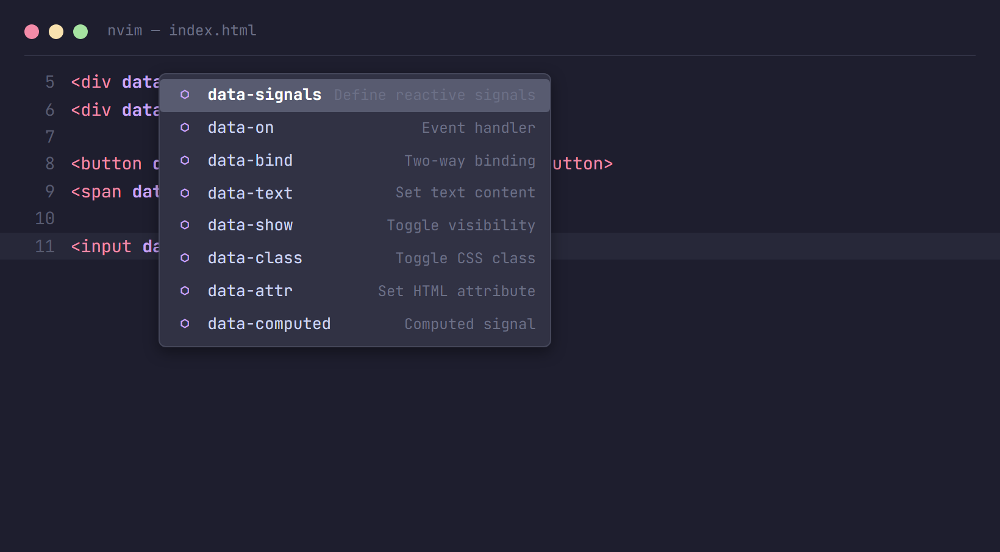
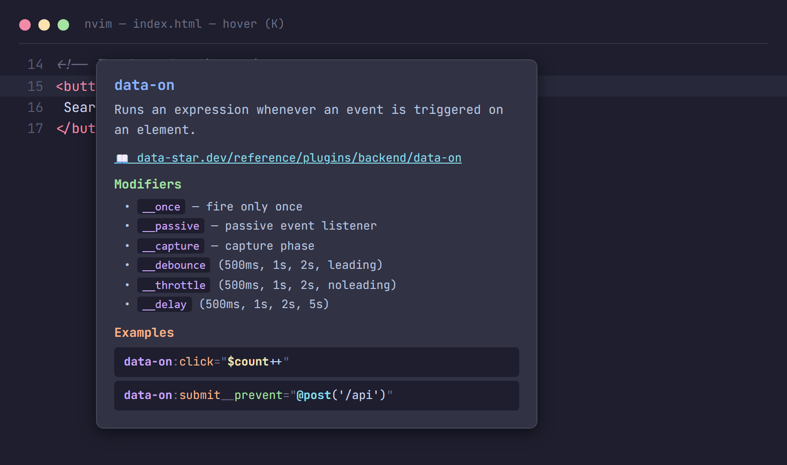
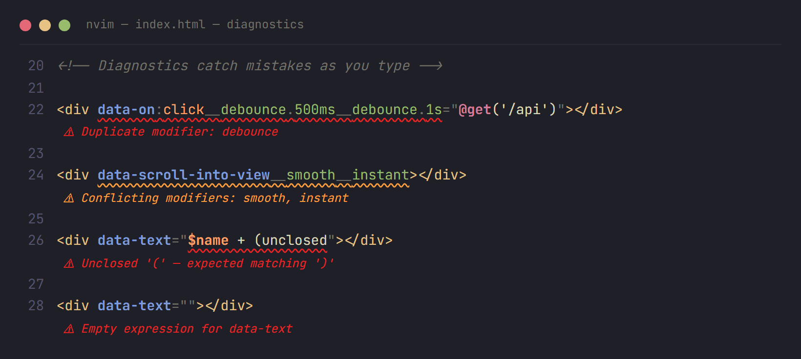
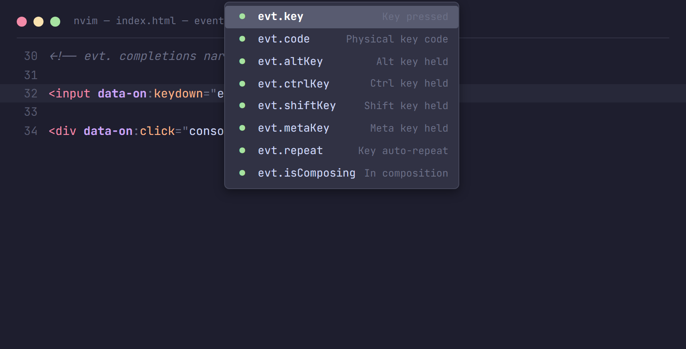
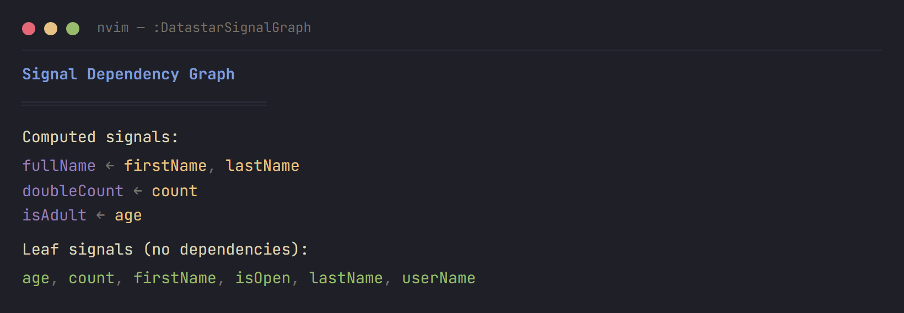

<div align="center">

# 🌟 datastar.nvim

**IDE-quality [Datastar](https://data-star.dev) support for Neovim**

Completions · Hover Docs · Diagnostics · Signal Navigation · Dependency Graph

*The most feature-rich Datastar development experience in any editor.*


</div>

---

## ✨ Features at a Glance

### Smart Completions

Type `data-` and get context-aware completions for all 31 Datastar plugins, with descriptions and docs links.



### Rich Hover Documentation

Press `K` on any `data-*` attribute to see descriptions, available modifiers, and curated code examples.



### Real-Time Diagnostics

Catch mistakes as you type — duplicate modifiers, conflicting options, unclosed expressions, and more.



### Event Type Narrowing

Type `evt.` inside a `data-on` handler and get completions specific to that event type. `keydown` shows `KeyboardEvent` properties, `click` shows `MouseEvent` properties.



### Signal Goto Definition

Press `gd` on any `$signal` reference to jump to where it was defined.


### Signal Dependency Graph

Run `:DatastarSignalGraph` to visualize how computed signals depend on each other.



---

## 🚀 Quick Start

### Install with [lazy.nvim](https://github.com/folke/lazy.nvim)

```lua
{
  "WillEhrendreich/datastar.nvim",
  ft = "html",
  opts = {},
}
```

### Install with [packer.nvim](https://github.com/wbthomason/packer.nvim)

```lua
use {
  "WillEhrendreich/datastar.nvim",
  config = function()
    require("datastar").setup()
  end,
  ft = "html",
}
```

### Verify

```vim
:checkhealth datastar
```

**That's it.** Open an HTML file, type `data-`, and completions appear.

---

## 🔌 Completion Engines

Works with your existing setup — pick one:

| Engine | Setup |
|--------|-------|
| **omnifunc** (built-in) | Zero config. Press `<C-x><C-o>` |
| **nvim-cmp** | Add `{ name = "datastar" }` to sources |
| **blink.cmp** | Add `datastar` provider — see [Integrations](docs/integrations.md) |

<details>
<summary><strong>nvim-cmp config</strong></summary>

```lua
cmp.setup({
  sources = cmp.config.sources({
    { name = "nvim_lsp" },
    { name = "datastar" },
    { name = "luasnip" },
  }),
})
```

</details>

<details>
<summary><strong>blink.cmp config</strong></summary>

```lua
{
  "Saghen/blink.cmp",
  opts = {
    sources = {
      default = { "lsp", "path", "snippets", "buffer", "datastar" },
      providers = {
        datastar = {
          name = "datastar",
          module = "datastar.cmp_source",
          score_offset = 100,
        },
      },
    },
  },
}
```

</details>

---

## 🧠 What It Knows

The plugin understands the full Datastar attribute grammar:

```
data-[plugin]:[key]__[modifier].[arg]="expression"
```

| Context | Trigger | What You Get |
|---------|---------|--------------|
| Attribute name | `data-` | All 31 plugins with descriptions |
| Key | `data-on:` | DOM events, HTML attrs, CSS classes |
| Modifier | `__` | Plugin-specific modifiers |
| Modifier arg | `__debounce.` | Time values, flags |
| Expression | `="..."` | `$signals`, `@actions()`, `evt.*` |

**31 plugins** · **83 DOM events** · **97 HTML attributes** · **8 backend actions** · full modifier trees

---

## ⚙️ Configuration

```lua
require("datastar").setup({
  diagnostics = true,       -- inline error/warning diagnostics
  hover = true,             -- K for hover docs
  goto_definition = true,   -- gd for signal navigation
  filetypes = { "html" },   -- activate for these filetypes
  version = nil,            -- filter features by Datastar version
})
```

---

## 📚 Documentation

| Guide | Description |
|-------|-------------|
| [Getting Started](docs/getting-started.md) | Installation and first steps |
| [Completions](docs/completions.md) | All 5 completion contexts explained |
| [Diagnostics](docs/diagnostics.md) | Error detection and severity levels |
| [Navigation](docs/navigation.md) | Goto definition and signal graph |
| [Configuration](docs/configuration.md) | All options with defaults |
| [Integrations](docs/integrations.md) | nvim-cmp and blink.cmp setup |

---

## 🏗️ Architecture

This is a **pure Lua plugin** — no LSP server binary, no Node.js, no external processes. Datastar's attribute grammar is finite, so the entire schema lives in a Lua table and the context parser is a fast backward scan from your cursor position.

- **Zero startup cost** — no process to spawn
- **Instant completions** — no network round-trips
- **Works offline** — everything is bundled
- **275 tests** — thoroughly tested with [busted](https://lunarmodules.github.io/busted/)

---

## 🙏 Acknowledgments

- [Datastar](https://data-star.dev) by Delaney Gillilan — the hypermedia framework this plugin supports
- [htmx-lsp](https://github.com/ThePrimeagen/htmx-lsp) — inspiration for the approach
- The Datastar [VSCode extension](https://github.com/starfederation/datastar/tree/main/tools/vscode-extension) and [IntelliJ plugin](https://github.com/starfederation/datastar/tree/main/tools/intellij-plugin) — reference implementations

## 📄 License

MIT
